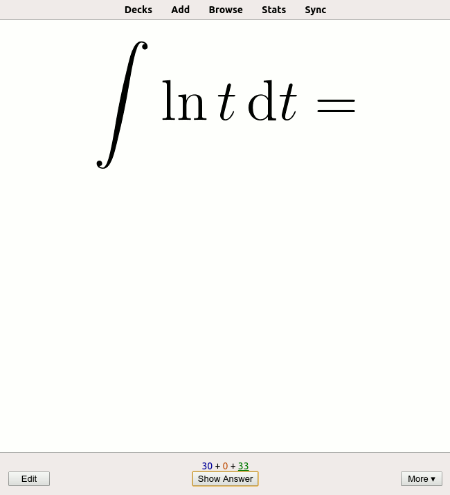

# Stage 1/7: Stage one, card one
## Description
A flashcard is a digital or paper card that contains a term on one side, and a definition, translation, or explanation of that term on the other. Flashcards are often used for learning foreign languages and are an effective study technique for many people.



<i>An example of a flashcard. The upper part is the term the user is being asked, the lower part is the correct answer. Source: <a href="https://en.wikipedia.org/wiki/Flashcard">Wikipedia</a>.</i>

For this project, we’ll refer to the text on the front of the card as the term, and the text on the back will be the definition. There won't actually be any visual "front" and "back" side of a card: it'll all be done through sequential text. We'll ask the user for the definitions of the terms they previously entered, and check whether the given answers are correct. While developing this application, you will not only learn some programming but also save paper!

## Objectives
Implement a program that outputs 4 lines:

- The first line is `Card`:
- The second line is the term on the front of the card
- The third line is `Definition`:
- The fourth line is the definition on the back of the card

In this stage, the term and the definition can be anything you want.

## Examples
Here are some output examples to clarify what the result should look like.

<b>Example 1.</b>
```
Card:
purchase
Definition:
buy
```

<b>Example 2.</b>
```
Card:
cos'(x)
Definition:
-sin(x)
```
